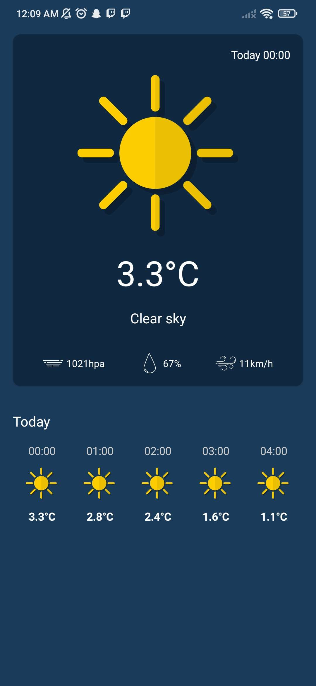

# TutorialWeatherApp
This repository is made public for me to let you know my advance with Kotlin, so here is a tutorial I followed.

The goal of this project is to create a Kotlin Android App with [Clean Code Architecture](https://blog.cleancoder.com/uncle-bob/2012/08/13/the-clean-architecture.html), using the [Open-Meteo API](https://open-meteo.com/).

I struggled a lot in the beginning to understand a new structure.
I still managed to follow the tutorial so I'm happy with the fact that I learned something new.
I still didn't get all the concept of clean code and Kotlin's architecture but I'am getting there !

## My Result : The location is Lyon, France

## What can I do to had more challenge to this project
- Add an something that can let me change the location.
- Add more variables in the api call to get more information about the weather.
- Maybe change the UI with something I chose or made.
- For the weekly weather, things like chart to make it more readable.

Those are many options that I can work on in the future.

Thank you to Philipp Lackner for this great tutorial.

## The link of the tutorial
[Tutorial Weather App](https://www.youtube.com/watch?v=eAbKK7JNxCE&t=935s) from [Philipp Lackner](https://www.youtube.com/@PhilippLackner) on Youtube.

#### Initial source code which is the base for the tutorial
[WeatherApp source code](https://github.com/philipplackner/WeatherApp/tree/master) by [Philipp Lackner](https://github.com/philipplackner) on Github.

#### This is the mockup used for the UI/UX of the app
[MockUp](https://dribbble.com/shots/17998271-Cuacane-Weather-App) by [Hakim Haiman](https://dribbble.com/mochamadhakim) on Dribbble.

